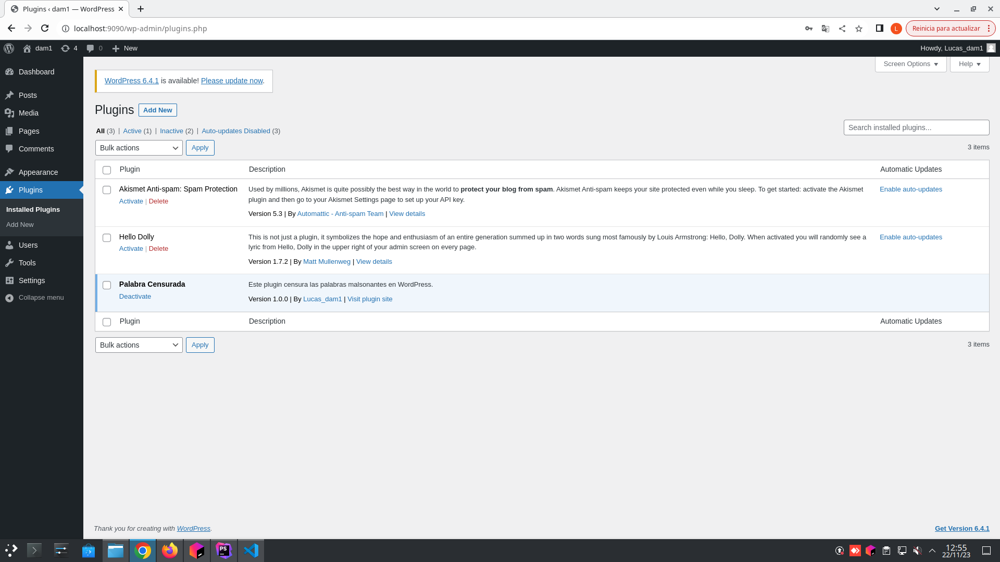
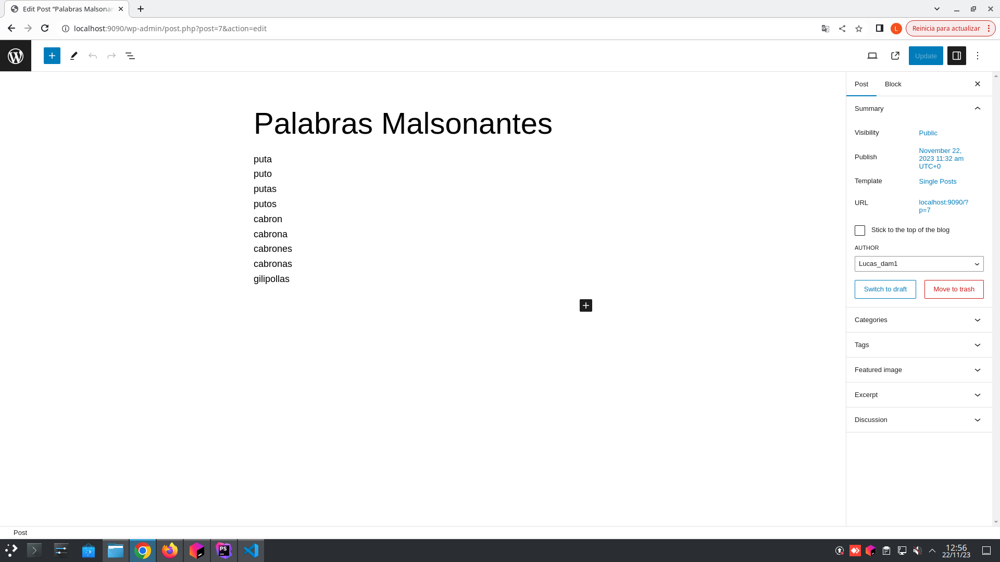
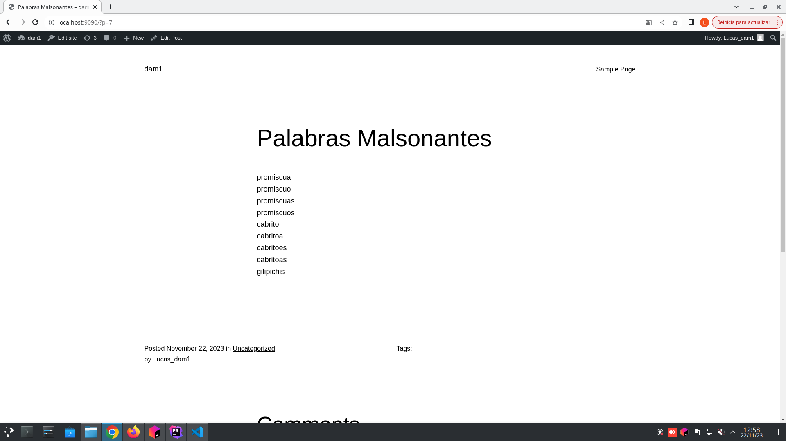

# Creacion de plugin en Wordpress
En este repositorio se encuentra el plugin creado para el intercambio de datos de varias palabras malsonantes por un eufeminismo.

## Creacion del plugin
Para la creacion del plugin se ha seguido los siguientes pasos:

1. Primero se le dan permisos de escritura al directorio de plugins.
    ```bash
    sudo chmod -R 775 src/
    ```
2. Se cambia el propietario del directorio de plugins.
    ```bash
    sudo chown -R User src/
     ```
2. Crear un archivo php dentro de la carpeta del plugin.
    ```bash
    touch src/wp-content/plugins/NombreDelPlugin.php
    ```
3. Dentro del archivo php se añade el siguiente codigo para que wordpress reconozca el plugin.
    ```php
    <?php
    /**
   * @package
     * @version 
       */
       /*
       Plugin Name: 
       Plugin URI: 
       Description: 
       Author: 
       Version: 
       Author URI: 
       */
    ```
4. Y debajo de este codigo se añade el codigo del plugin.

## Funcionamiento del plugin

1. El plugin se activa desde el panel de administracion de wordpress.
   

2. Creamos el post que queremos modificar.
   

3. A la hora de mostrar el post en el front-end, el plugin sustituye las palabras malsonantes por un eufeminismo.
   